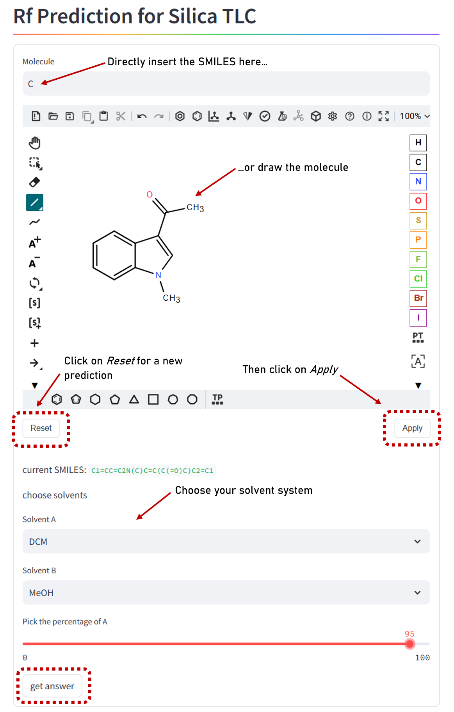

<h1 align="center">
<i><b>rfpred 🧪 </b></i>
</h1>

<br>


🔍 Package that predicts the Rf values for silica thin-layer-chromatographies (TLCs) in synthesis labs based on the chemical compound and the solvent system.

## 🔥 Usage

After installing, you should create a new file and activate the environment where you installed ***rfpred***. The function below will start a streamlit web app as a local host in your browser with the prediction interface.

```python
import rfpred

# One line to rule them all
rfpred.App.run()
```

If you want to run the prediction without the interface, use the `rfpred.Prediction` function.

```python
from rfpred import Prediction

pred = Prediction()
rf_value = pred.predict(compound_smile, solvent_a, solvent_b, percent_solvent_a)
```
To get to know, which solvents you can choose from for the prediction, run

```python
solvents = pred.solvents
print(solvents)

```
after initiation of your `Prediction` object.

## 👩‍💻 Installation

Create a new environment, you may also give the environment a different name and activate this new environment.

```
conda create -n rfpred python=3.10
```
```
conda activate rfpred
```

Then simply pip install the package by copying this into your command line.
```
(rfpred) $ pip install "git+https://github.com/MW21P/rfpred.git"
```
Then create a new file and proceed how described in the Usage section.

❗ The installation is currently incompatible with iMac M1/M2 Chips due to a conflict with the LightGBM package. On Windows it works perfectly fine. ❗
Possible solution: After creating and activating the enviroment install Homebrew:
```
/bin/bash -c "$(curl -fsSL https://raw.githubusercontent.com/Homebrew/install/HEAD/install.sh)"
```
Add Homebrew to your path. You will finde a describtion for that in your terminal after installing Hombrew.
Now you can install libomp with Homebrew.
```
brew install libomp
```
Finally LightGBM will be installable:
```
pip install lightgbm
```

## ⚡Using the Streamlit Web Application

This is a short User's manual to get familiar with the Web Interface of the prediction mode.



## Run tests and coverage

```
(conda_env) $ pip install tox
(conda_env) $ tox
```

## 📖 Authors
Milena Wiegand: https://github.com/MW21P

Matthias Galka: https://github.com/MGalka66

This project was carried out as part of EPFL's ***super cool*** "Practical programming in Chemistry" course.

